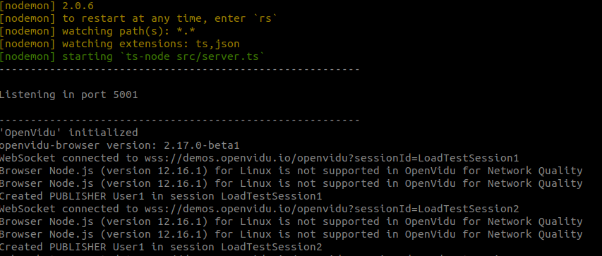

# OpenVidu Load Test

> WARNING: The current tool is under development which means that bugs could be present in the code and you can expect some changes in usage.

This repository contains a distributed tool that allows you to perform a load test against an OpenVidu CE or an OpenVidu PRO deployment.

Take into account that you must to deploy OpenVidu platform before using this tool.

<br>

# **Table of Contents**
1. [Project Architecture](#project-architecture)
2. [Usage instructions](#usage-instructions)
3. [Sample test execution](#sample-test-execution)
4. [Analyze test results](#analyze-test-results)
5. [Browser Emulator documentation](#browser-emulator-documentation)

<hr>

## **Project Architecture**


* [**Browser-emulator**](#browser-emulator): Worker service that emulates a browser capable of connecting to an OpenVidu session and sending and receiving WebRTC media using openvidu-browser library. It is implemented in NodeJS and controlled with a REST protocol. WebRTC stack is provided by [node-webrtc library](https://github.com/node-webrtc/node-webrtc).
* [**Load Test**](#load-test): Controller service in charge of the coordination of the browser-emulator workers. It read the load test scenario from a file and control the browser-emulator workers to simulate participants loading OpenVidu platform.

## **Usage Instructions**

These instructions assume that OpenVidu CE or PRO is already deployed. See [how deploy OpenVidu PRO](https://docs.openvidu.io/en/2.16.0/openvidu-pro/#how).

To start with the load test you will have to deploy the workers first and the execute the controller.

This instructions assume you are using a linux system. Windows and Mac can require some adaptation.

### 1. Deploy workers

In the machines were you want to execute the workers you need to have NodeJS platform installed.

Then follow these steps:

**1. Clone this repository**

```bash
git clone https://github.com/OpenVidu/openvidu-loadtest.git
```

**2. Start browser-emulator (worker)**

```bash
cd openvidu-loadtest/browser-emulator/
npm install
npm run start
```

By default, this worker is listening on port `5000` that you have to specify later in the controller configuration. If you want to run it on another port just add `SERVER_PORT=port_number` before `npm run start` command:

```bash
SERVER_PORT=6000 npm run start
```

### 2. Execute controller

In the machine you want to execute the controller you need to have Java 11 platform installed.

Then follow these steps:

**1. Clone this repository**

```bash
git clone https://github.com/OpenVidu/openvidu-loadtest.git
```

**2. Configure OpenVidu platform and workers**

Fill `OPENVIDU_URL`, `OPENVIDU_SECRET` and  `WORKER_URL_LIST` parameters in load-test [`load-test/src/main/resources/application.properties`](load-test/src/main/resources/application.properties):

Run this command **under project root directory**:

```bash
nano load-test/src/main/resources/application.properties
```
After these three parameters are being filled, save changes and go to the next step.

```properties
OPENVIDU_URL=https://openvidu_pro_url
OPENVIDU_SECRET=openvidu_pro_secret
WORKER_URL_LIST=http://worker_host1:port,http://worker_host2:port
```

**3. Configure session typology:**

Controller is being developed to allow the configuration of the load test cases: number of participants, typology, number of sessions, etc.

Currently, the only available option is the change of the number of participants of the session.

To configure the test cases the file [`load-test/src/main/resources/test_cases.json`](load-test/src/main/resources/test_cases.json) has to be edited:

```json
{
	"testcases": [
		{
			"typology": "N:N", // All users will be PUBLISHERS and SUBSCRIBERS
			"participants": [2], // Sessions with 2 users
			"sessions": "infinite", // Test will create infinite sessions
			"desciption": "This test case will add infinite sessions (until it reaches its limit) of publishers that the array of participants indicates"
		}
	]
}
```

**3. Run load test:**

When you execute the load test the controller will create sessions and will connect participants into them automatically.

The load test will stop when any of the browser-emulators return something different from a `200` status response. Take into account that errors can be produced by OpenVidu errors or if the worker itself is overloaded. Please control CPU usage in workers.

When an error in a worker is produced, the load test will stop and will order to destroy and close every participants and sessions to the workers.

For start with it, run the following command:

```bash
cd load-test
mvn spring-boot:run
```

## **Sample test execution**

For illustration proporses here is an example composed by 2 workers and the load test app all of them running locally.

As you can see in the load test and workers logs, the load test app will create sessions and will add participants into them following a [**round-robin scheduling**](https://en.wikipedia.org/wiki/Round-robin_scheduling).

**Load test logs**


Which it means that, for this sample with sessions of 2 participans, each participant will be create by one different worker. The `User0` will be create by the worker 1 and the `User1` will be created by the worker2.

Thus achieving more capacity in the load test and less resource consumption.

**Worker 1 logs**


**Worker 2 logs**



## **Analyze test results**

With the current version the tools doesn't generate any test results by itself. It just generate load into OpenVidu.

If you have deployed OpenVidu PRO you can [create your own visualizations in Kibana](https://docs.openvidu.io/en/2.16.0/openvidu-pro/monitoring-elastic-stack/#creating-your-own-visualizations-and-dashboards) or you can export the raw data and use another tool. Remember that ELK stack has monitoring information about the platform (CPU, memory usage, bandwidth, etc) and also high level information (sessions, participants, etc.)

## **Browser Emulator documentation**

Service with the aim of emulating a standard browser using [OpenVidu Browser library](https://github.com/OpenVidu/openvidu#readme) and overriding WebRTC API with [node-webrtc library](https://github.com/node-webrtc/node-webrtc).

This app provides a simple REST API that will be used by **Load Test application** and it allows:
* Create a [Stream Manager](https://docs.openvidu.io/en/2.16.0/api/openvidu-browser/classes/streammanager.html) (`PUBLISHER` or `SUBSCRIBER`)
* Delete a Stream Manager by its connectionId
* Delete all Stream Manager with a specific role (`PUBLISHER` or `SUBSCRIBER`).

### API REST

#### CREATE STREAM MANAGER

_Create a new Stream Manager with a specified **role** and connect it into a specified **sessionName**_

* #### METHOD: **POST**

* #### URL:  http://localhost:5000/openvidu-browser/streamManager

* #### BODY
	```json
	{
		"openviduUrl": "http://localhost:4443",
		"openviduSecret": "MY_SECRET",
		"userId": "User1",
		"sessionName": "LoadTestSession",
		"properties": {
			"role": "PUBLISHER",
			"audio": true,
			"video": true
		}
	}
	```

* #### RESPONSE
	```json
	{
		"connectionId": "con_FmtswrvbkT",
		"workerCpuUsage": 10.00
	}
	```

#### DELETE STREAM MANAGER (by connectionId)

_Delete a single Stream Manager by its connectionId_

* #### METHOD: **DELETE**

* #### URL:  http://localhost:5000/openvidu-browser/streamManager/connection/{{CONNECTION_ID}}


#### DELETE STREAM MANAGER's (by ROLE: `PUBLISHER` or `SUBSCRIBER`)

_Delete all Stream Manager with the specified ROLE_

* #### METHOD: **DELETE**

* #### URL:  http://localhost:5000/openvidu-browser/streamManager/role/{{ROLE}}

