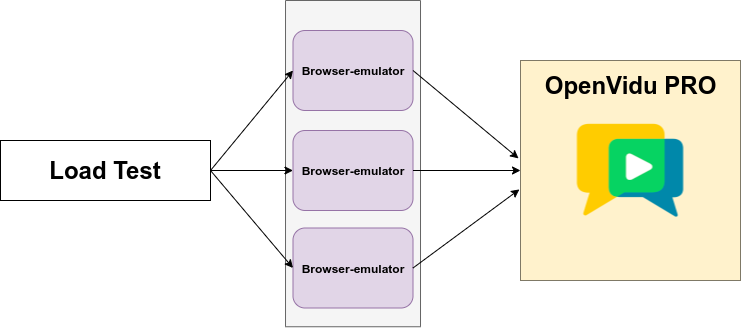
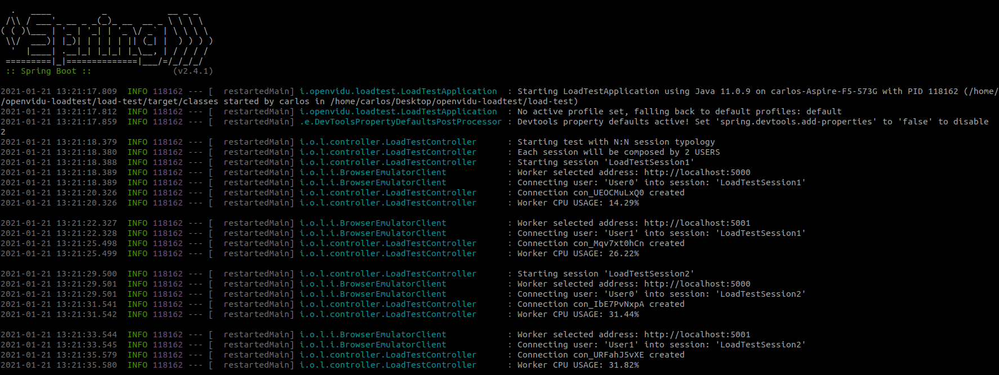
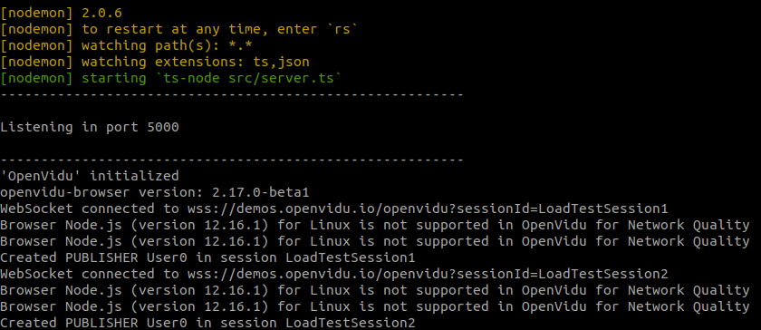

# OpenVidu Load Test

> WARNING: The current repository is under development which means that bugs could be present in the code.

<br>

# **Table of Contents**
1. [Project Architecture](#project-architecture)
2. [Load Test (Controller)](#load-test)
3. [Browser Emulator (worker)](#browser-emulator)
4. [Usage](#usage)
4. [Visualize Test Data](#visualize-data)
5. [Test Sample](#test-sample)

<hr>

## **Project Architecture**



* [**Load Test**](#load-test): App based on Java 11 that will handle the load tests.
* [**Browser-emulator**](#browser-emulator): REST service based on NodeJS and Express able to create sessions and participants into them in OpenVidu.

## **Load Test**

It will be in charge of handling the test load cases. These test cases will be described in the [test_cases.json](load-test/src/main/resources/test_cases.json) file:

```json
{
	"testcases": [
		{
			"typology": "N:N", // All users will be PUBLISHERS
			"participants": [2], // Sessions with 2 users
			"sessions": "infinite", // Test will create infinite sessions
			"desciption": "This test case will add infinite sessions (until it reaches its limit) of publishers that the array of participants indicates"
		}
	]
}
```

This application will must have one or more **workers** *(browser-emulator instances)* at its disposal. The workers address will must be assigned as a environment variable `WORKER_URL_LIST`. See [application.properties](load-test/src/main/resources/application.properties) file.

Beside, two more parameters will be required. These are `OPENVIDU_URL` and `OPENVIDU_SECRET`.

The load test will stop when any of *workers* return something different from a `200` status response.

## **Browser Emulator**

Service with the aim of emulating a standard browser using [OpenVidu Browser library](https://github.com/OpenVidu/openvidu#readme) and overriding WebRTC API with [node-webrtc library](https://github.com/node-webrtc/node-webrtc).

This app provides a simple REST API that will be used by **Load Test application** and it allows:
* Create a [Stream Manager](https://docs.openvidu.io/en/2.16.0/api/openvidu-browser/classes/streammanager.html) (`PUBLISHER` or `SUBSCRIBER`)
* Delete a Stream Manager by its connectionId
* Delete all Stream Manager with a specific role (`PUBLISHER` or `SUBSCRIBER`).


### API REST

#### CREATE STREAM MANAGER

_Create a new Stream Manager with a specified **role** and connect it into a specified **sessionName**_

* #### METHOD: **POST**

* #### URL:  http://localhost:5000/openvidu-browser/streamManager

* #### BODY
	```
	{
		"openviduUrl": "http://localhost:4443",
		"openviduSecret": "MY_SECRET",
		"userId": "User1",
		"sessionName": "LoadTestSession",
		"role": "PUBLISHER"
	}
	```

* #### RESPONSE
	```
	{
		"connectionId": "con_FmtswrvbkT"
		"workerCpuUsage": 10.00
	}
	```

#### DELETE STREAM MANAGER (by connectionId)

_Delete a single Stream Manager by its connectionId_

* #### METHOD: **DELETE**

* #### URL:  http://localhost:5000/openvidu-browser/streamManager/connection/{{CONNECTION_ID}}


#### DELETE STREAM MANAGER's (by ROLE: `PUBLISHER` or `SUBSCRIBER`)

_Delete all Stream Manager with the specified ROLE_

* #### METHOD: **DELETE**

* #### URL:  http://localhost:5000/openvidu-browser/streamManager/role/{{ROLE}}


## **Usage**

These instructions assume that OpenVidu PRO is already deployed. See [how deploy OpenVidu PRO](https://docs.openvidu.io/en/2.16.0/openvidu-pro/#how).

To start with the load test:

**1. Clone the repository**

```bash
git clone https://github.com/OpenVidu/openvidu-loadtest.git
```

**2. Start browser-emulator (worker)**

```bash
cd openvidu-loadtest/browser-emulator/
npm install
npm run start
```

This app will run on port `5000` by default. If you want to run it on another port just add `SERVER_PORT=port_number` before `npm run start` command:

```bash
SERVER_PORT=6000 npm run start
```

**3. Fill `OPENVIDU_URL`, `OPENVIDU_SECRET` and  `WORKER_URL_LIST` parameters in load-test [`application.properties`](load-test/src/main/resources/application.properties):**

Opening a new console window, run this command **under project root directory**:

```bash
nano load-test/src/main/resources/application.properties
```
After these three parameters are being filled, save changes and go to the next step.

```properties
OPENVIDU_URL=https://openvidu_pro_url
OPENVIDU_SECRET=openvidu_pro_secret
WORKER_URL_LIST=http://worker1_url:port,http://worker2_url:port
```

**4. Run load test:**

Once you start the load test, it will create sessions and participants into them automatically.

The load test will stop when any of workers return something different from a `200` status response.

 When this happens, the load test will stop and will order destroy and close every participants and sessions to the workers.

 For start with it, run the following command:

```bash
cd load-test
mvn spring-boot:run
```


## **Visualize Data**

Nowadays you must [create your own visualizations and dashboards](https://docs.openvidu.io/en/2.16.0/openvidu-pro/monitoring-elastic-stack/#creating-your-own-visualizations-and-dashboards) of OpenVidu test data manually using the [external ElasticSearch and Kibana tools configured in OpenVidu PRO](https://docs.openvidu.io/en/2.16.0/openvidu-pro/monitoring-elastic-stack/#configuring-an-external-elastic-stack).


## **Test sample**

Here is an example composed by 2 workers and the load test app running locally.

As you can see in the load test and workers logs, the load test app will create sessions and will add participants into them intermittently, following the [**round-robin scheduling**](https://en.wikipedia.org/wiki/Round-robin_scheduling).

##### Load test


Which it means that, for this sample with sessions of 2 participans, each participant will be create by one different worker. The `User0` will be create by the worker 1 and the `User1` will be created by the worker2.

Thus achieving more capacity in the load test and less resource consumption.

##### Worker 1


##### Worker 2


